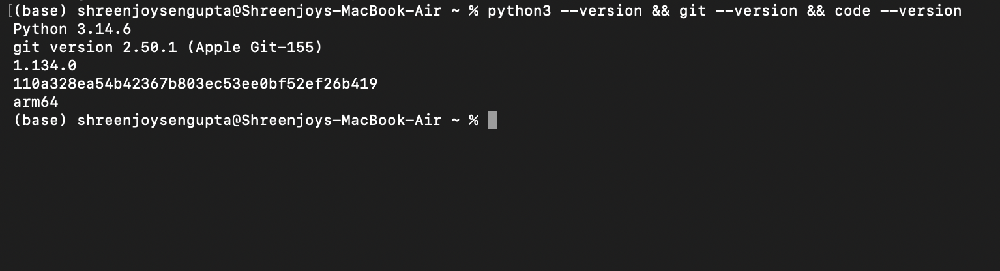
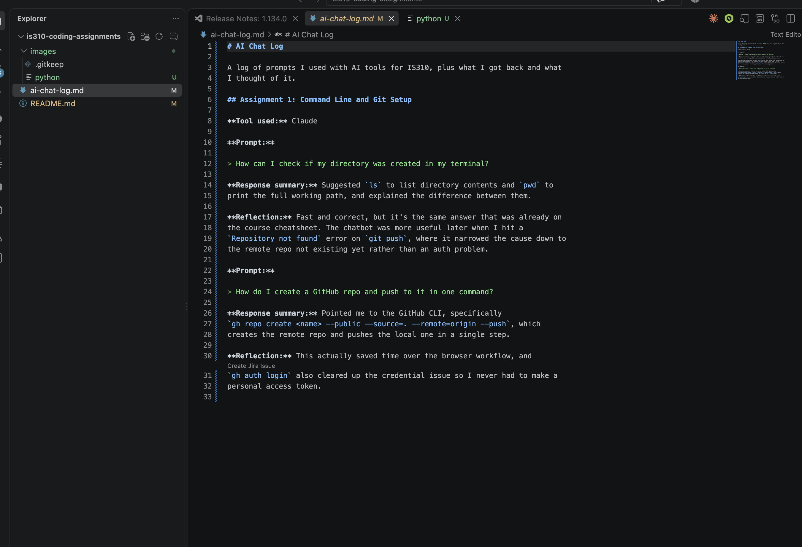

# IS310 Coding Assignments

Shreenjoy Sengupta | IS310 Culture as Data, Fall 2026

This repository holds my coding assignments for IS310.

## Contents

- `README.md` this file, including proof of required tool installations
- `ai-chat-log.md` a running log of my AI chatbot prompts and reflections
- `images/` screenshots and other image assets

## Required Tool Installations

| Tool | Installed | Version |
| --- | --- | --- |
| Python 3 | yes | 3.14.6 |
| Git | yes | 2.50.1 (Apple Git-155) |
| VS Code | yes | 1.134.0 |
| GitHub account | yes | github.com/Shreenjoy |
| zsh shell | yes | macOS default |
| Homebrew | yes | installed, used for gh |

### Proof

Version checks for Python, Git and VS Code run from the terminal:

VS Code running with this repository open:

## Setup Notes

Working on macOS (Apple Silicon) with zsh. Python 3.14.6 comes from my Anaconda
install, which is why the prompt shows `(base)`. Git is the Apple-bundled
version. Used Homebrew to install the GitHub CLI, which handled repo creation
and auth in one step.
